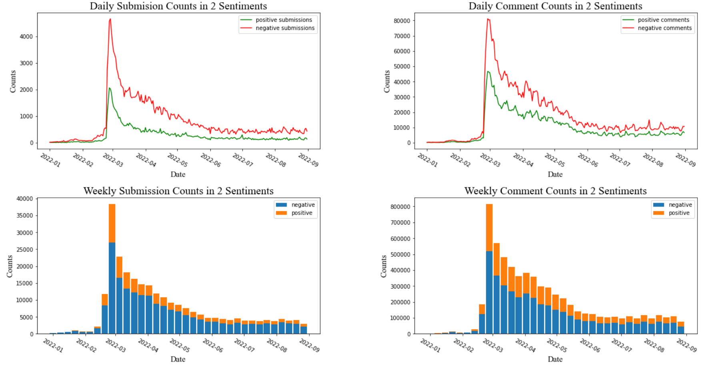

# Language Detection
* We first created the 'text' column, which represents for the concatenation of 'title' and 'selftext' in submissions or 'body' in comments.
* Then we used the pre-trained language detection pipeline **'detect\_language\_375'** provided by **John Snow Labs**, to achieve the language scores of 375 different scores. In our case, we only made use of the language scores of English, Russian and Ukrainian.
* We created sub-datasets of these 3 different languages by filtering the score of a specific language above 0.8. For example, we created the English dataset by the condition of English Score above 0.8.

# Data Cleaning(English)
* For the 'text' column we first removed the meanless tokens for Reddits of '[removed]', '[deleted]', '[deleted by user]'.
* Then we filtered out all the empty rows.
* Finally we applied the data cleaning pipeline composed of **'DocumentAssembler'**, **'DocumentNormalizer'**, **'Tokenizer'**,
**'StopWordsCleaner'**, **'TokenAssembler'**, which are all provided by **SparkNLP**.

# Sentiment Analysis(English)

## Creation of Sentiment-Related Columns
* We used the pre-trained pipeline of **'analyze\_sentimentdl\_use\_twitter'** provided by **John Snow Labs**, since that's the most suitable
medium-size pipeline for our Reddit case.
* While this pipeline outputed the four kinds of sentiment results: 'positive', 'negative', 'neutral', 'None', we created the new 'sentiment_score' column, which is 1.0 when positive and 0.0 otherwise, to place an accentuation on the positive sentiments.
* And we focused our NLP analysis on positive & negative reddits. 

## CSV Tables on a Daily Basis
We created four csv tables for the sentiments: two for the sentiment scores; two for the sentiment counts.

### Folder **'RU\_submission\_en\_sentiment'**:

**'avg\_sent\_twit.csv'** records the average sentiment score of all submissions on a daily base.

**'count\_sent\_twit.csv'** records the counts of submissions in different sentiments on a daily base.

### Folder **'RU\_comment\_en\_sentiment'**:

**'avg\_sent\_twit.csv'** records the average sentiment score of all comments on a daily base.

**'count\_sent\_twit.csv'** records the counts of comments in different sentiments on a daily base.

## Visualizations
We created two visualizations: one for the sentiment scores; one for the sentiment counts.

* For the sentiment scores, we created the side-by-side time-sery line plots using the daily average sentiment scores of submissions & comments. We used auxiliary lines of 'Trend' to describe the smooth tendency, whose values were computed as the mean values of sentiment scores of following 10 days.  

**Formula for Trend Computation:**  
$\qquad$ Suppose $SentimentScore\in\mathbb{R^N}$ and we have $Trend\in \mathbb{R^N}$,  
$\qquad$ (Trend series are in the same length with SentimentScore series.)  
$\qquad$ in which $Trend_i=Avg(SentimentScore_{i:min(i+10,N)})$  

* For the sentiment counts, we created the visualization composed of 4 subplots. While the above two are line plots for counts of submissions & comments in 2 different sentiments on a daily basis, the below two are stacked histograms for the same dataset on a weekly basis.

## Summary Tables
We created two summary tables for the sentiments: one for the average sentiment scores(on a daily basis); one for the scores(Column of the Original Dataset) in different sentiments.

**Stat Table of Daily Average Sentiment Scores**
| Sentiment Score Stats | Average | Minimum/Date | Maximum/Date | Std | Q1 | Q3 |  
|:-----:|:-----:|:-----:|:-----:|:-----:|:-----:|:-----:|
| Submissions | 0.244 | 0.086/01-12 | 0.481/01-01 | 0.041 | 0.220| 0.268 |  
| Comments | 0.344 | 0.251/01-22 | 0.422/01-02 | 0.028 | 0.334 | 0.362 |  

From the daily sentiment score summary table, we can see that:  
* The dates for maximum/minimum sentiment scores in Submissions and Comments are similar;  
* There is an evident difference between the distributions of sentiment scores in Submissions & Comments.  

**Stat Table of Scores in Two Sentiments**
| Score Stats | Counts | Average | Range | IQR | Std | Skewness |
|:-----:|:-----:|:-----:|:-----:|:-----:|:-----:|:-----:|
| Positive Submissions | 66445 | 296.23 | 0~108426 | 109 | 1741.93 | 22.05 |
| Negative Submissions | 192527 | 313.31 | 0~195763 | 168 | 1554.17 | 29.21 |
| Positive Comments | 2375428 | 9.51 | -618~8607 | 5 | 47.40 | 33.37 |
| Negative Comments | 4144561 | 10.87 | -657~9421 | 6 | 52.92 | 33.31|

From the daily score summary table, we extended that by doing two-sample t-test (Method provided by **scipy.stats.ttest_ind_from_stats**) between different sentiments.  

**Submission Score in 2 Sentiments**  
* Results of two-sample t-test:  
 $statistic = -2.36$  
 $pvalue = 0.0179$  
* Submissions with positive sentiments tend to have lower scores than submissions with negative sentiments.  

**Comment Score in 2 Sentiments**  
* Results of two-sample t-test:  
 $statistic = -32.64$  
 $pvalue=1.012\times10^{-233}$  
* Comments with positive sentiments tend to have lower scores than comments with negative sentiments.
